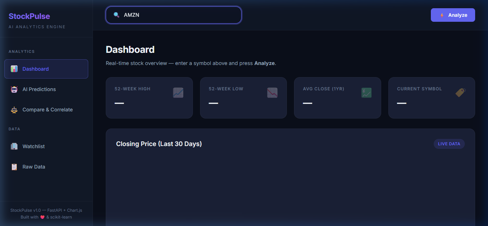
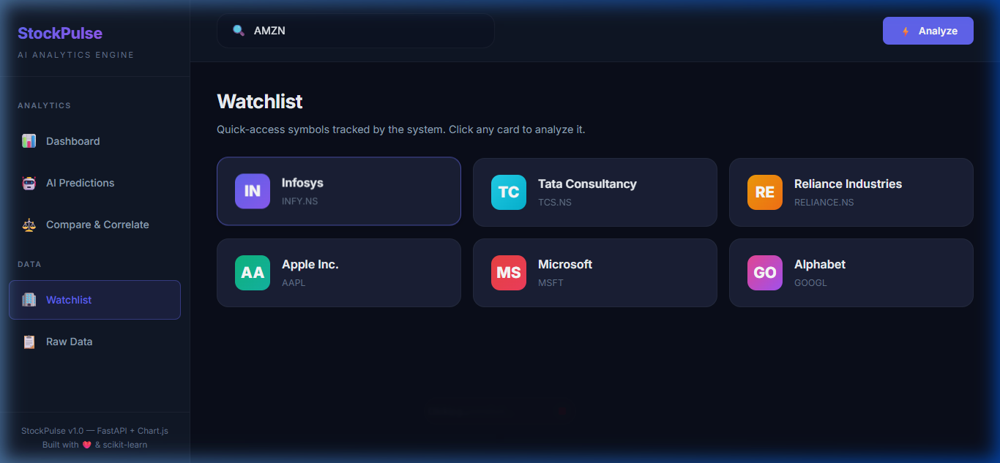
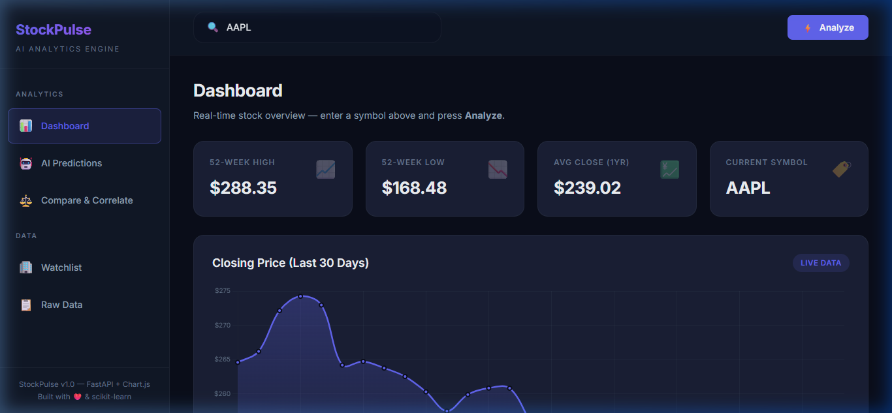
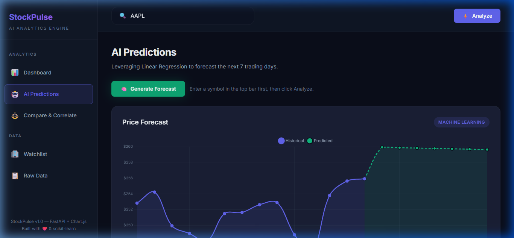
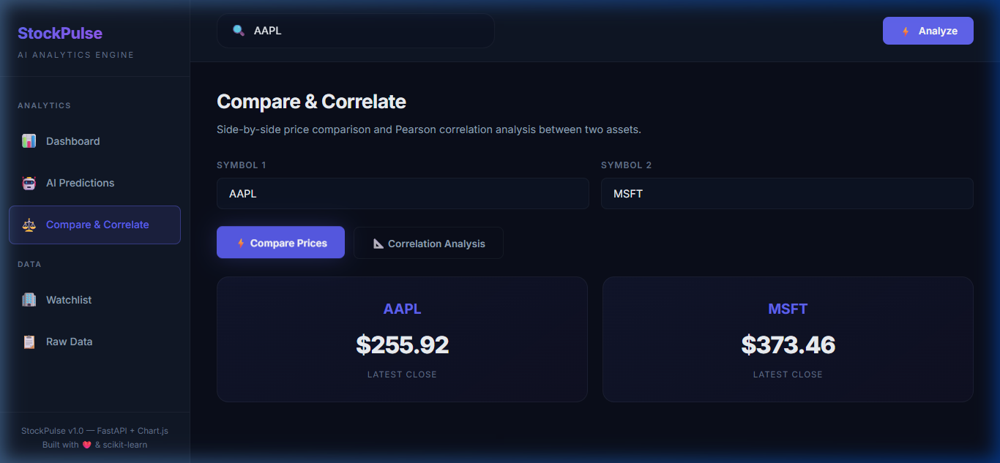

<p align="center">
  
  
  
  
  
</p>

<h1 align="center">📈 StockPulse — AI-Powered Stock Analytics Dashboard</h1>

<p align="center">
  <strong>A full-stack, modular stock market analytics platform with real-time data, interactive charts, AI-driven price forecasting, and cross-asset correlation analysis — all served from a blazing-fast FastAPI backend.</strong>
</p>

<p align="center">
  <a href="#-features">Features</a> •
  <a href="#-screenshots">Screenshots</a> •
  <a href="#-architecture">Architecture</a> •
  <a href="#-api-reference">API Reference</a> •
  <a href="#-getting-started">Getting Started</a> •
  <a href="#-deployment">Deployment</a>
</p>

---

## 🎥 Live Preview

> **Dashboard** → `https://stockpulse-ensv.onrender.com/static/index.html`
> **Swagger Docs** → `https://stockpulse-ensv.onrender.com/docs`
> **ReDoc** → `https://stockpulse-ensv.onrender.com/redoc`

---

## ✨ Features

| Category | Feature | Description |
|----------|---------|-------------|
| 📊 **Data Pipeline** | Real-time Fetching | Pulls 6 months of OHLCV data via `yfinance` for any publicly traded stock |
| 🧮 **Metrics Engine** | Financial Indicators | Computes **Daily Return**, **7-day Moving Average**, and **7-day Rolling Volatility** |
| 🗄️ **Persistence** | SQLite + SQLAlchemy | Cleaned data is persisted into a local `stock_data.db` with full ORM mapping |
| 🤖 **AI Forecasting** | Linear Regression | Predicts next **7 days** of closing prices using `scikit-learn` — visualized as a dashed trend overlay |
| ⚖️ **Comparison** | Side-by-Side Pricing | Compare latest closing prices of any two symbols instantly |
| 📐 **Correlation** | Pearson Coefficient | Calculates and visualizes the statistical correlation between two assets |
| 🏢 **Watchlist** | Quick Access Cards | One-click analysis for preset symbols (Infosys, TCS, Reliance, Apple, Microsoft, Alphabet) |
| 📋 **Raw Data View** | Interactive Table | All 30-day records with color-coded daily returns, MA, and volatility columns |
| 🔔 **Toast Alerts** | Live Notifications | Slide-in toast banners for loading, success, and error states |
| 🌙 **Dark Mode UI** | Premium Design | Glassmorphism, gradient accents, micro-animations, and responsive sidebar navigation |

---

## 📸 Screenshots

### 🏠 Dashboard — Initial State
Clean, minimal landing with stat cards awaiting analysis.



---

### 🏢 Watchlist — Company Cards
Click any card to auto-load its data into the Dashboard.



---

### 📊 Dashboard — Data Loaded (AAPL)
52-week stats populate alongside a smooth Chart.js closing price chart.



---

### 🤖 AI Predictions — Machine Learning Forecast
Historical prices (solid purple) vs predicted future (dashed green) with the `MACHINE LEARNING` badge.



---

### ⚖️ Compare & Correlate — AAPL vs MSFT
Side-by-side latest closing prices with Pearson correlation analysis tools.



---

## 🏗️ Architecture

```
StockPulse/
│
├── main.py                 # FastAPI application — all endpoints
├── data_fetcher.py         # yfinance data pipeline + metrics computation
├── database.py             # SQLAlchemy ORM models + DB operations
├── ml_model.py             # scikit-learn Linear Regression predictor
├── run_app.py              # Convenience script to launch uvicorn
├── requirements.txt        # Pinned dependencies
├── stock_data.db           # Auto-generated SQLite database
│
└── static/
    ├── index.html          # Full-stack SPA dashboard (HTML/CSS/JS)
    └── screenshots/        # UI screenshots for documentation
```

### Data Flow

```
┌──────────┐     ┌───────────────┐     ┌───────────┐     ┌──────────────┐
│  yfinance │────▶│ data_fetcher  │────▶│ database  │────▶│   FastAPI     │
│  (Yahoo)  │     │ + metrics     │     │ (SQLite)  │     │  Endpoints    │
└──────────┘     └───────────────┘     └───────────┘     └──────┬───────┘
                                                                │
                       ┌────────────┐                           │
                       │ ml_model   │◀──────────────────────────┤
                       │ (sklearn)  │                           │
                       └─────┬──────┘                           │
                             │                                  ▼
                             │                         ┌──────────────┐
                             └────────────────────────▶│  Frontend    │
                                                       │  (Chart.js)  │
                                                       └──────────────┘
```

### Module Responsibilities

| Module | Role |
|--------|------|
| `data_fetcher.py` | Fetches 6-month OHLCV data, cleans timestamps, computes Daily Return, 7-day MA, and Volatility |
| `database.py` | Defines `StockData` ORM model, manages SQLite connections, handles bulk insert with dedup |
| `ml_model.py` | Trains a `LinearRegression` model on historical closing prices and extrapolates 7-day predictions |
| `main.py` | Orchestrates all modules via 7 REST endpoints with CORS, static file serving, and error handling |
| `static/index.html` | Single-page application with 5 views, Chart.js visualizations, and async API integration |

---

## 🔌 API Reference

### Core Endpoints

| Method | Endpoint | Description | Response |
|--------|----------|-------------|----------|
| `GET` | `/` | Welcome message | `{ "message": "..." }` |
| `GET` | `/companies` | List tracked symbols | `{ "companies": [...] }` |
| `GET` | `/data/{symbol}` | Fetch + store + return last 30 days with metrics | `[ { Date, Open, High, Low, Close, Volume, Daily_Return, MA_7, Volatility_7 } ]` |
| `GET` | `/summary/{symbol}` | 52-week high, low, avg close | `{ "52_week_high", "52_week_low", "average_closing_price" }` |

### Advanced Endpoints

| Method | Endpoint | Description | Response |
|--------|----------|-------------|----------|
| `GET` | `/compare?symbol1=X&symbol2=Y` | Latest closing prices side-by-side | `{ "comparison": { "X": price, "Y": price } }` |
| `GET` | `/predict/{symbol}` | AI-predicted closing prices for next 7 days | `{ "dates": [...], "predicted_close": [...] }` |
| `GET` | `/correlation?symbol1=X&symbol2=Y` | Pearson correlation coefficient | `{ "correlation": 0.XXXX }` |

### Example Requests

```bash
# Fetch AAPL data with computed metrics
curl http://127.0.0.1:8000/data/AAPL

# Get 52-week summary for Microsoft
curl http://127.0.0.1:8000/summary/MSFT

# AI-predict next 7 days for Google
curl http://127.0.0.1:8000/predict/GOOGL

# Compare Apple vs Microsoft
curl "http://127.0.0.1:8000/compare?symbol1=AAPL&symbol2=MSFT"

# Correlation between Infosys and TCS
curl "http://127.0.0.1:8000/correlation?symbol1=INFY.NS&symbol2=TCS.NS"
```

---

## ⚙️ Getting Started

### Prerequisites

- **Python 3.9+** installed
- Internet connection (for `yfinance` API calls)

### 1. Clone the Repository

```bash
git clone https://github.com/YOUR_USERNAME/StockPulse.git
cd StockPulse
```

### 2. Create Virtual Environment

```bash
python -m venv venv

# Windows
.\venv\Scripts\activate

# macOS / Linux
source venv/bin/activate
```

### 3. Install Dependencies

```bash
pip install -r requirements.txt
```

### 4. Run the Server

```bash
uvicorn main:app --reload
```

### 5. Open the Dashboard

| Resource | URL |
|----------|-----|
| 🖥️ Dashboard UI | [https://stockpulse-ensv.onrender.com/static/index.html](https://stockpulse-ensv.onrender.com/static/index.html) |
| 📚 Swagger Docs | [https://stockpulse-ensv.onrender.com/docs](https://stockpulse-ensv.onrender.com/docs) |
| 📖 ReDoc | [https://stockpulse-ensv.onrender.com/redoc](https://stockpulse-ensv.onrender.com/redoc) |

---

## 💻 Tech Stack

| Layer | Technology | Purpose |
|-------|-----------|---------|
| **Backend** | FastAPI + Uvicorn | Async REST API framework with auto-generated Swagger docs |
| **Data** | Pandas + NumPy | DataFrame operations, rolling calculations, statistical analysis |
| **Stock API** | yfinance | Yahoo Finance wrapper for real-time OHLCV market data |
| **Database** | SQLite + SQLAlchemy | Lightweight relational storage with full ORM support |
| **Machine Learning** | scikit-learn | Linear Regression model for 7-day price extrapolation |
| **Visualization** | Chart.js | Interactive, responsive line charts with gradient fills |
| **Frontend** | Vanilla HTML/CSS/JS | Zero-dependency SPA with dark mode, glassmorphism, and animations |

---

## ☁️ Deployment

### Deploy on Render (Recommended)

1. **Push to GitHub**
   ```bash
   git init
   git add .
   git commit -m "Initial commit — StockPulse v1.0"
   git remote add origin https://github.com/YOUR_USERNAME/StockPulse.git
   git push -u origin main
   ```

2. **Create Render Web Service**
   - Go to [render.com](https://render.com) → **New +** → **Web Service**
   - Connect your GitHub repository

3. **Configure Build Settings**

   | Setting | Value |
   |---------|-------|
   | **Environment** | Python 3 |
   | **Build Command** | `pip install -r requirements.txt` |
   | **Start Command** | `uvicorn main:app --host 0.0.0.0 --port $PORT` |

4. **Deploy** — Render will auto-build and provide a public URL 🚀

### Deploy with Docker (Alternative)

```dockerfile
FROM python:3.11-slim
WORKDIR /app
COPY requirements.txt .
RUN pip install --no-cache-dir -r requirements.txt
COPY . .
EXPOSE 8000
CMD ["uvicorn", "main:app", "--host", "0.0.0.0", "--port", "8000"]
```

```bash
docker build -t stockpulse .
docker run -p 8000:8000 stockpulse
```

---

## 📂 Key Files Explained

<details>
<summary><strong>📄 data_fetcher.py</strong> — Data Collection & Metrics Engine</summary>

- Fetches 6 months of historical OHLCV data from Yahoo Finance
- Strips timezone info to prevent SQLite serialization errors
- Computes three financial indicators:
  - **Daily Return** = `(Close - Open) / Open`
  - **7-Day Moving Average** = Rolling mean of Close prices
  - **7-Day Volatility** = Rolling standard deviation of Close prices
</details>

<details>
<summary><strong>📄 database.py</strong> — SQLAlchemy ORM & Persistence</summary>

- Defines the `StockData` table with indexed columns for fast lookups
- Uses `bulk_save_objects()` for efficient batch inserts
- Implements symbol-level deduplication (clears old records before insert)
</details>

<details>
<summary><strong>📄 ml_model.py</strong> — AI Forecasting Module</summary>

- Converts dates to integer offsets (days-from-start) as the feature vector
- Trains `sklearn.linear_model.LinearRegression` on the full 6-month history
- Predicts closing prices for the next 7 calendar days
</details>

<details>
<summary><strong>📄 main.py</strong> — FastAPI Application</summary>

- 7 REST endpoints covering data, summary, comparison, prediction, and correlation
- CORS middleware enabled for cross-origin frontend access
- Static file mounting for the SPA dashboard
- Parallel data fetch + DB persistence on every `/data/{symbol}` call
</details>

<details>
<summary><strong>📄 static/index.html</strong> — Frontend SPA</summary>

- 5-page dark-mode SPA with sidebar navigation
- Chart.js for closing price and prediction overlay charts
- Async `fetch()` calls to all backend endpoints
- Toast notification system for real-time user feedback
- Fully responsive design with glassmorphism and gradient accents
</details>

---

## 🧠 AI / ML Details

The prediction engine uses **Linear Regression** — a supervised learning algorithm that finds the best-fit line through historical price data and extrapolates forward.

```
Price
  ▲
  │         ╱ ← Predicted (dashed)
  │       ╱
  │     ╱● ● ● ← Historical data points
  │   ●╱
  │  ●
  │ ●
  └──────────────────▶ Time
```

**Why Linear Regression?**
- Lightweight — trains in milliseconds on 6 months of data
- Interpretable — the slope directly represents price momentum
- Sufficient for short-term (7-day) trend extrapolation
- No GPU or complex infrastructure required

> ⚠️ **Disclaimer**: This is for educational/demonstration purposes only. Stock prices are influenced by countless factors — this model captures trend direction, not market events.

---

## 🤝 Contributing

Contributions are welcome! Here are some ideas:

- [ ] Add candlestick chart visualization
- [ ] Implement ARIMA or LSTM for better predictions
- [ ] Add user authentication and personalized watchlists
- [ ] Support cryptocurrency symbols
- [ ] Add export to CSV/PDF functionality
- [ ] Implement WebSocket for real-time price updates

---

## 📜 License

This project is open source and available under the [MIT License](LICENSE).

---

<p align="center">
  <strong>Built with ❤️ using Python, FastAPI, scikit-learn, and Chart.js</strong><br>
  <sub>StockPulse v1.0 — AI-Powered Stock Analytics Dashboard</sub>
</p>
